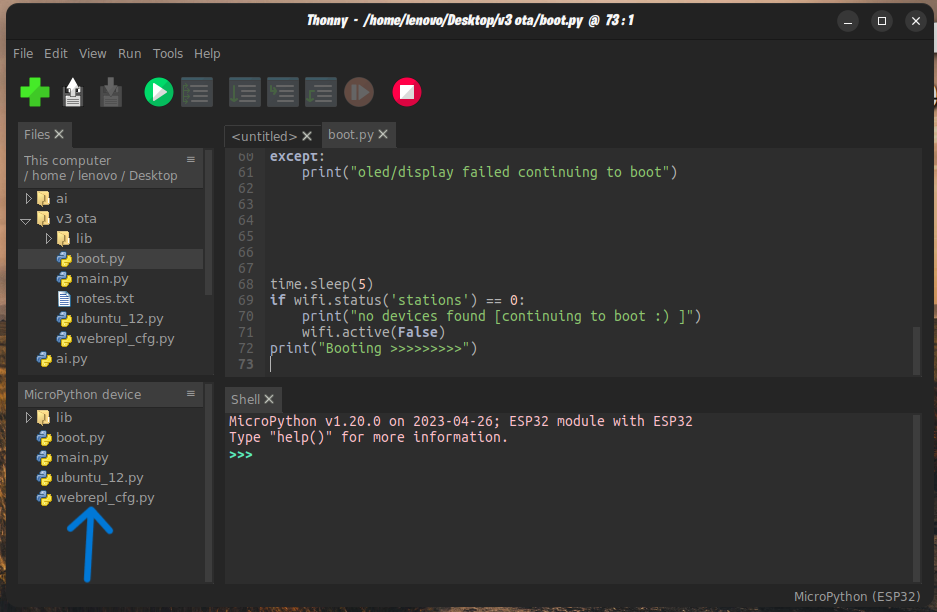
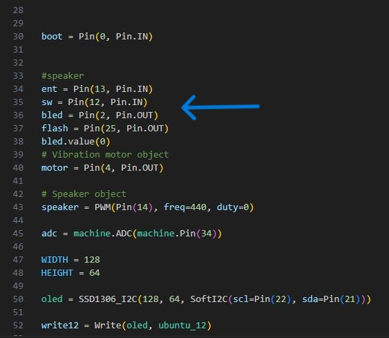

# ESPwatch
micropython/arduino and ESP32 based multipurpose watch

INSTALLATION

!git[micropython](<esp32 tut.JPG>)
-> install micropython firmware

-> copy all the files to your micropython directory

-> important: set the gpio pins before using the code. also edit the ssid and psk in main.py

-> ssid='webrepl', password='731235' default SSID and password for the AP

-> connect to webrepl ssid "when the display shows ota mode" with your pc to edit the codes

-> hardware requirements:

-speaker-
-vibration motor-
-buttons x2-
-oled display(i2c)-
-flash led-
-internal led-

